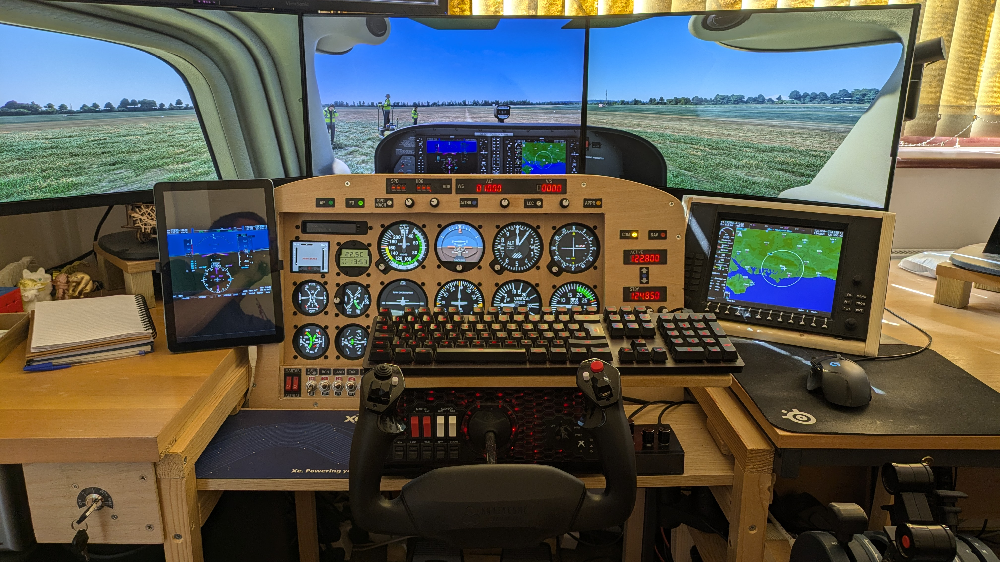

# MICROSOFT FLIGHT SIMULATOR 2020 - INSTRUMENT DATA LINK

This is the companion program to

  https://github.com/scott-vincent/instrument-panel
  
  https://github.com/scott-vincent/autopilot-panel
  
  https://github.com/scott-vincent/radio-panel
  
  https://github.com/scott-vincent/power-lights-panel

This program must run on the same host as MS FS2020 and uses the Microsoft
SimConnect SDK to connect to FS2020 and collect all the data required by the
instrument panel.

The instrument panel connects to this program over your network and receives
the data at regular intervals so that the instruments can be drawn with
up-to-date values.

# Donate

If you find this project useful, would like to see it developed further or would
just like to buy the author a beer, please consider a small donation.

